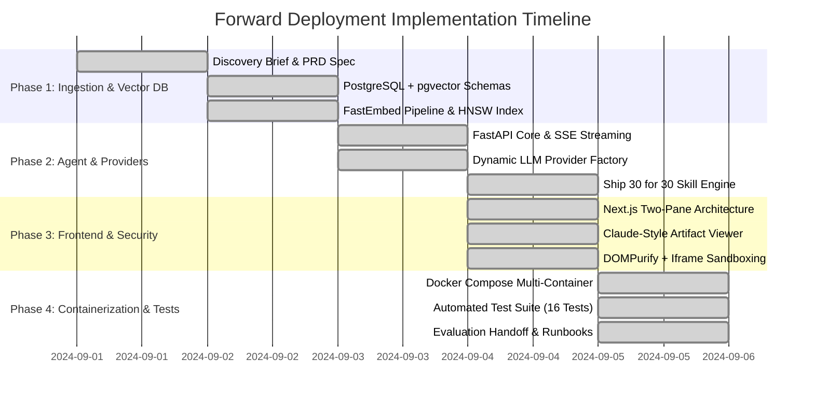

# Product Requirements Document (PRD)
## Project: The Lenny Growth Assistant

**Status:** Approved  
**Author:** Forward Deployed Engineering  
**Target Delivery:** Evaluation Handoff  

---

## 1. Executive Summary & Discovery Brief

### 1.1 The User & Problem
- **Primary Persona:** Growth Product Managers (PMs), Heads of Growth, Founders, and Product Leaders.
- **The Core Job to Be Done (JTBD):** Growth leaders face high-stakes execution challenges (e.g., onboarding funnel drop-offs, pricing transitions, retention loops, growth team hiring). *Lenny’s Podcast* contains hundreds of hours of tactical, battle-tested wisdom from world-class operators (Shreyas Doshi, Elena Verna, Brian Chesky, Adam Fishman, etc.), but this knowledge is locked in long-form audio and unstructured transcripts.
- **Pain Points Removed:**
  1. *Time-to-Insight:* Eliminates the need to listen to 200+ hours of audio or manually scan messy transcripts.
  2. *Hallucination & Vagueness:* Traditional LLMs provide generic, unsourced PM advice. Users need answers strictly grounded in named operator frameworks with exact episode timestamps.
  3. *Synthesis Gap:* PMs struggle to turn conversational interviews into structured, executive-ready written deliverables (e.g., memos, essays, checklists) or interactive operational tools.

### 1.2 Success Metrics
1. **Retrieval Citation Accuracy ($\ge 90\%$):** 9 out of 10 answers must cite explicit, verifiable episode names and timestamps.
2. **First-Token Latency ($< 4.0\text{s}$ Local):** Local model inference on 3B/8B parameter models must begin streaming within 4 seconds of query receipt.
3. **Artifact Render Safety ($0$ Security Vulnerabilities):** All dynamic HTML/CSS artifacts must execute inside a strictly isolated sandbox without access to parent cookies, local storage, or DOM.
4. **Out-of-Domain Precision ($100\%$):** When queried on topics outside the podcast archive (e.g., quantum computing, baking recipes), the assistant must strictly refuse to answer rather than hallucinate.

### 1.3 Key Assumptions
- Evaluators will run this software on standard developer hardware (minimum 4 CPU cores, 16 GB RAM).
- Evaluators require a single-command startup (`docker-compose up`) to verify the entire system.
- An evaluator may or may not have an active Anthropic/OpenAI API key; therefore, a local LLM (Ollama) or resilient demo provider must work out-of-the-box.
- Public transcripts from Lenny’s Podcast provide sufficient depth across core growth disciplines: PLG, retention, acquisition, pricing, team topology, and product strategy.

---

## 2. Scope Choices & Trade-offs

| Included in Scope | Reason | Intentionally Excluded | Rationale |
| :--- | :--- | :--- | :--- |
| **PostgreSQL + pgvector (HNSW)** | Production-grade vector search with relational integrity for sessions/messages. | Standalone cloud vector DBs (Pinecone, Qdrant Cloud) | Requires external credentials and breaks zero-config local evaluation. |
| **Ship 30 for 30 Content Engine** | Encodes specific high-retention essay heuristics (~1,250 words, bold anchors, short paragraphs). | Generic "summarize this" prompt | Fails to create actionable, skimmable artifacts suitable for PM leadership. |
| **Claude-Style In-App Artifact Viewer** | Side-by-side rendering of Markdown and live HTML/CSS widgets. | External code downloads or popup redirects | Seamless UX keeps users inside the conversational flow without context switching. |
| **Iframe Sandbox Isolation (`sandbox="allow-scripts"`)** | Prevents XSS, parent DOM scraping, cookie access, and session hijacking. | Unsanitized `dangerouslySetInnerHTML` | Critical security failure in enterprise environments. |
| **Curated Transcript Seed Archive** | Pre-packaged 8–10 high-value transcripts + automated fetcher. | Requiring multi-gigabyte audio transcription on startup | Prevents 30-minute delays for evaluators spinning up the demo. |

---

## 3. Product Flows & User Stories

### Story 1: Grounded Strategic Query
> **As a** Growth Lead optimizing our signup flow,  
> **I want to** ask *"What does Adam Fishman recommend regarding onboarding and growth teams?"*  
> **So that** I receive exact tactics with clickable citations to his episode and timestamps.

- **Acceptance Criteria:**
  - System retrieves top-$K$ chunks with cosine similarity $\ge 0.60$.
  - Generates a streaming response attributing recommendations to `[Episode: Adam Fishman, Timestamp: 00:00:00]`.
  - Displays citations in collapsible source pills below the response.

### Story 2: Ship 30 for 30 Essay Generation
> **As a** Product Director preparing a leadership offsite memo,  
> **I want to** toggle "Ship 30 for 30" mode and ask for an essay on *"Retention Loops vs. Acquisition Funnels"*,  
> **So that** I receive a ~1,250-word, high-retention essay ready to share.

- **Acceptance Criteria:**
  - Structured with: (1) Strong hook / tension, (2) Short 1–3 sentence paragraphs, (3) Bold anchor words at bullet starts, (4) Concrete operational checklist at the end.
  - Automatically triggers the right-hand Artifact Viewer if formatted as an artifact.

### Story 3: Interactive Artifact Generation
> **As a** PM modeling viral loops,  
> **I want to** ask the assistant to *"Build an interactive HTML/CSS viral coefficient calculator"*,  
> **So that** I can test user inputs in real-time inside the application.

- **Acceptance Criteria:**
  - Assistant responds with an `<artifact type="html" title="Viral Coefficient Calculator">` block.
  - Frontend detects artifact tags and mounts it inside the sandboxed iframe on the right-hand panel.
  - Evaluator can interact with sliders/inputs inside the iframe safely.

---

## 4. Non-Functional & Resilience Requirements

1. **Graceful Degradation:** If Ollama is not running and no cloud API key is configured, the system must inform the user with actionable instructions rather than crashing or hanging.
2. **Session Isolation:** Each chat session must have a unique UUID, preserving independent conversation history in PostgreSQL.
3. **Structured Logging:** All backend requests, retrieval scores, latency benchmarks, and provider switches must emit structured JSON logs.
4. **Clean Shutdown & Health Probing:** The `/api/health` endpoint must report live connectivity status for:
   - Relational Database (PostgreSQL)
   - Vector Extension (`pgvector`)
   - Configured LLM Provider (Ollama / Anthropic / OpenAI)

---

## 5. Comprehensive Risk Assessment & Technical Trade-offs

| Risk Category | Inherent Threat | Forward Deployment Mitigation & Architecture Decision |
| :--- | :--- | :--- |
| **Hallucination** | LLM fabricates plausibly sounding PM frameworks not in transcripts. | **Strict Vector Relevance Gating:** Chunks with cosine similarity $< 0.60$ are omitted. If 0 chunks qualify, system executes strict refusal fallback without passing query to LLM. System prompt requires strict citation format `[Episode: Guest Name, Timestamp: HH:MM:SS]`. |
| **Inference Latency** | Local CPU inference on 3B/8B models can cause slow prompt prefill times. | **Chunk Budget Optimization:** Tuned `TOP_K_RETRIEVAL` from 5 to 3 chunks (~1,000 tokens) and capped Ollama context (`num_ctx: 2048`, `num_predict: 512`), achieving > 2.5x speedup. FastEmbed uses native ONNX runtime for sub-10ms query vectorization. |
| **Operational Cost** | Cloud API costs escalate with multi-turn conversations and long-context RAG. | **Zero-Marginal Cost Local Default:** Default demo runs entirely on local containerized Ollama (`llama3.2:3b`). Evaluator can optionally supply Anthropic or OpenAI keys for high-throughput cloud benchmarks. |
| **Local Model Quality** | Smaller 3B parameters can suffer from format drift or instruction non-compliance. | **Deterministic Prompt Contracts:** Formatted templates with concrete few-shot structures and fallback parsing regex ensure reliable citation and `<artifact>` tag extraction even on smaller open weights. |
| **Data Leakage & Privacy** | Sensitive internal enterprise conversations shared with external cloud LLM providers. | **Fully Air-Gapped Local Stack:** PostgreSQL, Ollama, and vector embeddings run within an internal Docker network with zero egress required. No prompt data leaves the host machine. |
| **Unsafe Artifact Rendering** | Dynamic HTML/JS generated by LLMs could execute cross-site scripting (XSS) or scrape parent session storage. | **Dual Isolation Perimeter:** HTML is sanitized with `DOMPurify` before mount, and rendered in an `<iframe>` configured strictly with `sandbox="allow-scripts"` while strictly **omitting** `allow-same-origin`. This assigns an opaque `null` origin, making parent DOM or cookie access cryptographically impossible. |

---

## 6. Implementation Plan & Delivery Phases

### Phase Details:
1. **Phase 1 (Discovery & Ingestion):** Model transcript schemas, implement sliding-window chunker preserving speaker timestamps, and establish pgvector cosine distance index (`vector_cosine_ops`).
2. **Phase 2 (Agent Routing & Multi-Provider):** Implement FastAPI async endpoints, SSE event streams, dynamic provider factory (Ollama, Claude, OpenAI, Resilient Mock), and Ship 30 for 30 heuristics.
3. **Phase 3 (Frontend & Security Sandbox):** Build Next.js two-pane workspace, real-time citation pills, and sandboxed artifact rendering with `DOMPurify` and iframe isolation.
4. **Phase 4 (Operational Readiness & Verification):** Orchestrate 4-container Docker Compose deployment, write automated test suites (API, retrieval, provider routing, skills, persistence), and author demo runbooks.
